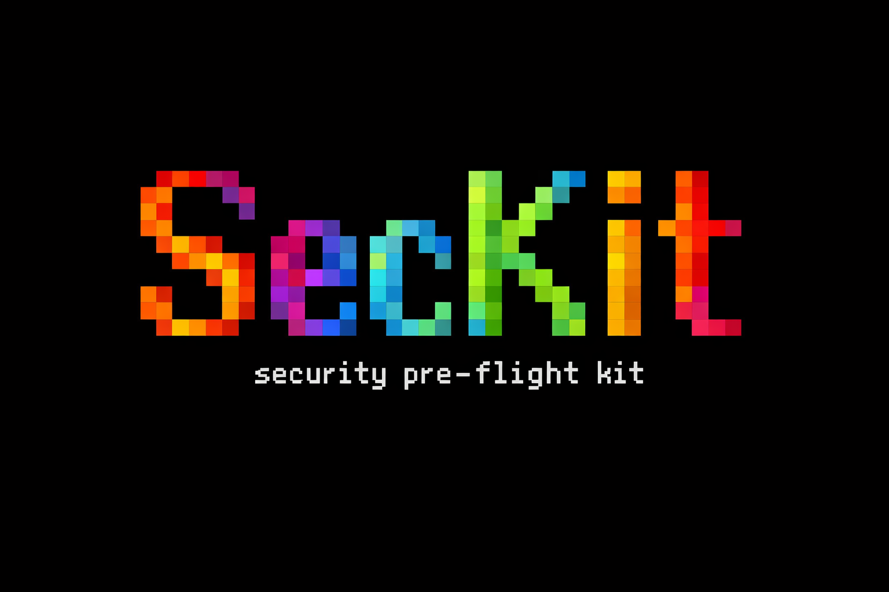

<p align="center">
  
</p>

<p align="center">Your portable security pre-flight kit. Run it before you work in any repo.</p>

<p align="center">
  <a href="https://github.com/segraef/sec-kit/actions/workflows/ci.yml"></a>
  <a href="https://github.com/segraef/sec-kit/actions/workflows/ci.yml?query=branch%3Amain"></a>
  <a href="LICENSE"></a>
</p>

## Run it

```bash
git clone https://github.com/segraef/sec-kit.git && cd sec-kit
bash seckit.sh              # macOS / Linux
pwsh ./seckit.ps1           # Windows
```

| Action        | What it does                                                                                                                                                   |
| ------------- | -------------------------------------------------------------------------------------------------------------------------------------------------------------- |
| **doctor**    | Reports which scanners and clients (jq, yq, gh, az, gitleaks, semgrep, checkov, osv-scanner, trufflehog, pre-commit) are installed and which are missing.      |
| **install**   | Installs every missing scanner and client via brew/npm/pipx/scoop. Run this once on a fresh machine.                                                           |
| **scan**      | Sweeps a folder of repos for vulnerable dependencies, code/IaC flaws, malware and secrets. Pick all scanners or a subset (osv, gitleaks, trufflehog, semgrep, checkov, socket). |
| **scan-skill** | Statically vets an AI agent skill or MCP server (directory, `.zip` or git URL) before you install it: prompt-injection, data exfiltration, credential theft, supply-chain RCE, obfuscation, over-broad agency and MCP tool poisoning. Never executes the target; prints a 0-100 risk verdict and a markdown report. |
| **harden**    | Drops pre-commit, gitleaks, SECURITY.md, CODEOWNERS, dependabot, CodeQL and PR templates into a repo so the next commit is clean.                              |
| **agent**     | Installs the SecKit prompt as a Claude subagent, Copilot chat mode, Cursor rule or `AGENTS.md` section so any AI assistant runs the same playbook.             |
| **mcp**       | Wires the official MCP servers (Semgrep, Snyk, OSV, Trivy, Scorecard, GitHub, ADO, Atlassian, Microsoft Learn, Terraform, Foundry) into Claude/Copilot/Cursor. |
| **audit**     | Read-only posture check against a GitHub org/repo or Azure DevOps project/repo. Safe to run anywhere because every call is a `GET`.                            |
| **enforce**   | Writes the missing settings flagged by `audit`. Dry-run by default; pass `--apply` / `-Apply` to actually write.                                               |
| **reminders** | Prints every security reminder in the kit. Handy as a checklist.                                                                                               |

## Run it in CI

Drop-in pipelines that run the same flow on every push: `seckit install` provisions the scanners, `seckit scan` sweeps the repo, and the markdown report is published as a build artifact. They clone SecKit at run time, so the only thing your repo needs is the one file.

- **GitHub Actions:** [`.github/workflows/seckit-scan.yml`](.github/workflows/seckit-scan.yml)
- **Azure Pipelines:** [`.pipelines/seckit-scan.yml`](.pipelines/seckit-scan.yml)

Both are soft-fail by default (findings produce a warning plus the report artifact, not a red build); flip the gate step to `exit 1` / remove `continueOnError` to block merges on findings.

More: [`docs/`](docs/) · [`CONTRIBUTING.md`](CONTRIBUTING.md) · [`LICENSE`](LICENSE)

